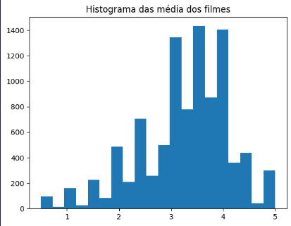
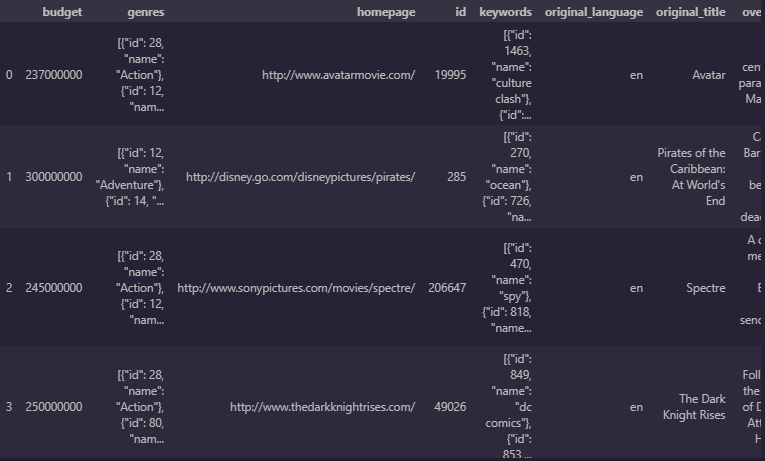
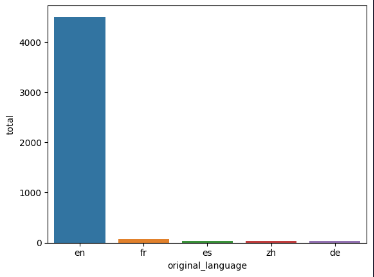
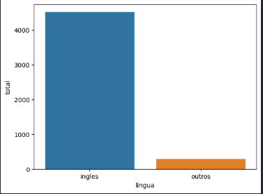
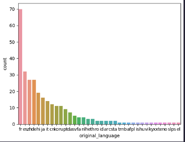
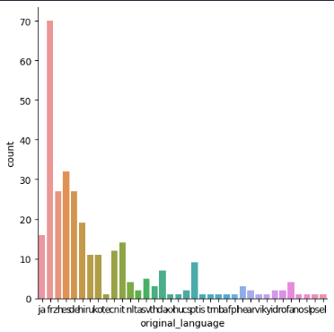
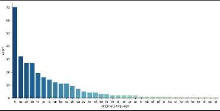
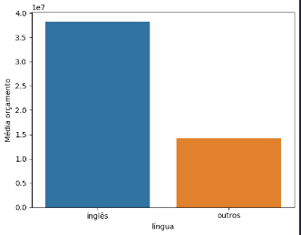

# Iniciando uma análise mais aprofundada de filmes específicos

Agora, irei carregar a tabela referente aos filmes que foram avaliados, cujo as notas estão no arquivo utilizado anteriormente.
````bash
#Carregando os filmes
movies = pd.read_csv("movies.csv", sep="")
movies.columns = ["Filme","Título","Gênero"]
movies
````


___
Analisarei agora as notas do filme Toy Story, e visto que a ID desse filme é 1, recorreremos à tabela das notas e filtraremos as notas que correspondem apenas ao filme com ID 1, que é o Toy Story, e verificarei sua média.

````bash
toy_story = notas.query("IDfilme == 1")
media_toy = toy_story["notas"].mean()
print("As notas que Toy Story recebeu foram: ", toy_story["notas"].unique())
print(f"A média das notas de Toy Story é: {media_toy:.2f}")
````
`As notas que Toy Story recebeu foram:  [4.  4.5 2.5 3.5 3.  5.  0.5 2.  1.5]`

`A média das notas de Toy Story é: 3.92`
___
Agora utilizarei o método .groupby() que aceita como argumento uma coluna de um dataframe para agrupar a outra coluna desejada a partir de um parâmetro. No caso eu irei agrupar a média das notas de cada filme à seus respectivos ID´s.
````bash
series_media = (notas.groupby("IDfilme")
                ["notas"].mean())
series_media.head()
````
| IDfilme | Média
----------|------
1    |3.920930
2    |3.431818
3    |3.259615
4    |2.357143
5    |3.071429
___

Agora utilizando a biblioteca **matplotlib.pyplot** irei plotar um histograma com 20 barras e utilizando ométodo _title_ para dar um título ao gráfico.

````bash
plt.hist(series_media, bins = 20)
plt.title("Histograma das média dos filmes")
````

____
____
___
___

# Iniciando a análise das línguas originais de filmes do tmdb

Agora carregaremos um arquivo que possui um dataframe contendo informações sobre orçamento, gêneros, ID do filme, língua original, título do filme e entre outras informações.

````bash
tmdb_movies = pd.read_csv("tmdb_5000_movies.csv")
tmdb_movies.head()
````


Importante ressaltar, que pelo fato de termos informações sobre cada filme, infere que temos diversos tipos de **variáveis**. Para que possamos analisarmos esses dados, é recomendável que haja uma breve explicação sobre essas variáveis.

- **Variável Categórica:** Uma variável categórica é uma variável que representa uma categoria, ou seja, não informa quantidade e nem possui ordem de grandeza, como a língua original de um filme, por exemplo.
- **Variável quantitativa:** Uma variável quantitativa é composta por valores, ou seja, quantidade. 

Como uma variável catégorica não possui ordem de grandeza, pode-se utilizar variáveis quantitativas associadas as suas respectivas variáveis categóricas para ordená-las a partir de um critério. Por exemplo, podemos ordenar as línguas originais de maneira em que uma mais falada originalmente nos filmes apareça em primeiro do que uma menos falada.
___

#### Sendo assim, utilizaremos o método _.value_counts()_ na coluna referente às línguas originais, que retornará uma serie com as línguas ordenadas de maneira decrescente e a contagem de filmes que possuem tallíngua como língua original.

````bash
tmdb_movies["original_language"].value_counts()
````

|original_language||
------------------|-----|
en      |4505
fr      |70
es      |32
zh      |27
de      |27
hi      |19
ja      |16
it      |14
cn      |12
ru      |11
ko      |11
pt      |9
da      |7
 
Percebemos que a lígua original predominante dentre os 5 mil fimes é o inglês, com 4505 filmes com essa língua.
___

Com isso, transformarei a serie da contagem das línguas em um dataframe para facilitar a visualização e manipulação.
````bash
contagem_de_lingua = tmdb_movies["original_language"].value_counts().to_frame().reset_index()
contagem_de_lingua.columns = ["original_language", "total"]
contagem_de_lingua
# Utilizar o .reset_index() é imprescindível pois o 'original_language' está como índice da série, logo ele vai para o dataframe como índice também, por isso precisa-se resetar o index.
`````
index|original_language|total|
------|------------|-----|
0|	en|	4505
1|	fr|	70
2|  es|	32
3|	zh|	27
4|	de|	27
5|	hi|	19
6|	ja|	16
7|	it|	14
8|	cn|	12
9|	ru|	11
10|	ko|	11
11|	pt|	9
12|	da|	7
13|	sv|	5

___
Agora, para represnetar essa discrepância visualmente, irei plotar um gráfico de barras utilizando a biblioteca **seaborn** que mostra a contagem das 5 primeiras línguas.

### O método _sns.barplot()_aceita como argumento: 
* _x_="coluna do Df que ficará no eixo x",   
* _y_="coluna que ficará no eixo y",  
* _data_="dataframe base".

````bash
sns.barplot(x="original_language",
            y="total",          
            data = contagem_de_lingua.head())
````


Perceba que a predominância da língua inglesa faz com que pareça que ela está mais presente que até o total do restante de línguas.
___

Para comprovar se isso procede, utilizarei o método _.value_counts()_ na coluna de línguas do df principal e somar todas com _.sum()_, o que me dará o total de línguas. E para saber o restante, utilizarei o método _.loc["en"]_ que retorna o total de línguas em inglês e subtrair esse número do total de línguas geral.

````bash
total_por_lingua = tmdb_movies["original_language"].value_counts()

ingles = total_por_lingua.loc["en"]
geral = total_por_lingua.sum()
outros = geral - ingles

print(f"Filmes em inglês: {ingles}. Resto: {outros}")
````
`Filmes em inglês: 4505. Resto: 298`

Como imaginado, há mais filmes em inglês nessa base de dados do que o restante somado.
___

Agora eu transformarei esses dados em um dataframe para facilitar visualização e plotagem.

````bash
dados = {
    "língua":["ingles","outros"],
    "total":[ingles,outros]
}
df_dados = pd.DataFrame(dados)
df_dados
````
|língua|total|
-------|-----|
ingles|4505
outros|298
___

Agora eu farei uma plotagem comparativa entre a língua inglesa e o restante.

````bash
sns.barplot(x="língua",
            y="total",
            data=df_dados)
````

___

Agora irei representar a ordem das línguas originais que **não** são o inglês.

* Primeiramente irei filtrar as línguas diferentes(!=) do inglês.
* Depois, irei definir a quantidade de filmes de cada língua com _.value_counts()_
* Com isso, irei transformar a serie da contagem das línguas restantes em um dataframe.
* Por fim, realizar a plotagem do gráfico.

````bash
tmdb_sem_ingles = tmdb_movies.query( "original_language != 'en'")
series_outros = tmdb_movies.query("original_language != 'en'")["original_language"].value_counts()
df_outros = tmdb_sem_ingles["original_language"].value_counts().to_frame().reset_index()

sns.barplot(x="original_language",
            y="count",
            data=df_outros,
)
````


Porém, perceba que esse gráfico não está muitobem representado. Logo, iniciarei métodos para refinar sua visualização.
___

O método _sns.catplot()_ será o método utilizado pois, além de não haver a necessidade de especificar o eixo y para utilizar como base para a plotagem, ele aceita argumentos para mudar sua aparência.

O _.catplot()_ aceita a coluna desejada para o eixo x do gráfico: _x_="coluna".

Aceita um _kind=_ para o tipo de método aplicado na coluna inputada no x:
_kind=_ count para contagem.

E aceita um _data=_ para a base de dados.

````bash
sns.catplot(x="original_language",
            kind="count",
            data=tmdb_sem_ingles)
````


Porém, perceba que ele ainda não está bem apresentado. Aí que entrarão os argumentos que o _.catplot()_ aceita para mudar a aparência do gráfico.

* _aspect=_ 1 para quadrangular/2 para retangular
* _pallete=_ "Cor desejada"
* _order=_ ordem em que as barras irão ser atribuídas.

Para o _order=_ utilizarei a ordem dos índices da serie de contagem de valores do restante das linguas.

Para o _pallete=_ utilizarei uma paleta que assume uma cor degradê que clareia a cor do maior para o menor.

````bash
sns.catplot(
            x="original_language",
            kind="count",
            data=tmdb_sem_ingles,
            aspect=2,
            palette="GnBu_r",
            order=series_outros.index,
            )
````


Perceba agora que o gráfico está mais legível, e suas cores agoram representam uma relação de proporção direta com a frequência das línguas.
___

A conclusão a partir disso que, nesse dataset contendo 5000 filmes avaliados no imdb, do total, 4505 são filmes que possuem como língua original o inglês, e o restante são outras línguas, o que pode indicar uma predominância massiva do inglês e da cultura audiovisual americana/britânica na indústria audiovisual. Para poder afirmar isso, seria necessário uma análise utilizando um datast com muito mais filmes.

Mas, dentro desses 5000, por que a língua inglesa predomina? Uma das hipóteses seria que, além do inglês ser a língua maisfalada do mundo, filmes em inglês possuam orçamentos maiores, o que impulsiona o marketing desses filmes e permite a contratação de atores e atrizes mundialmente famosos para compor o elenco, o que eleva a popularidade.
___

Portanto, agora irei analisar de maneira comparativa a média do orçamento dos filmes em inglês com o orçamento do restante dos filmes.

````bash
orcamento_ingles = tmdb_movies.query("original_language == 'en' & budget != 0")
total_orcamento_ingles = orcamento_ingles["budget"].sum() 
media_orcamento_ingles = orcamento_ingles["budget"].mean()

dict_orcamento_ingles = {
                "inglês":["Média orçamento","Orçamento total"],
                "resultado":[f"{media_orcamento_ingles:.2f}",
                             f"{total_orcamento_ingles:.2f}"]
}
df_orcamento = pd.DataFrame(dict_orcamento_ingles)
df_orcamento
````
|inglês|resultado|
-------|---------|
Média orçamento	|38204965.32
Orçamento total	|136926595701.00
* Perceba que como argumento para o método _.query()_ eu passei como argumento além dos filmes com língua inglesa, eu filtrei filmes que não possuem informações sobre orçamento. Caso contrário, o espaço amostral seria afetado e a média seria menor do que ela realmente é.

* Mostrei também o orçamento total apenas para visualização, pois, pelo fato de que 90% dos filmes do são em inglês, logo, evidentemente o orçamento total (soma dos orçamentos dos filmes) será maior.

Temos que a Média do orçamento de filmes em inglês é de 30394360.87 milhões de dólares.
___

Agora irei calcular a média do orçamento de filmes que não são em inglês.

````bash
orcamento_outros = tmdb_movies.query("original_language != 'en' & budget != 0")
total_orcamento_outros = orcamento_outros["budget"].sum()
media_orcamento_outros = orcamento_outros["budget"].mean()

dict_orcamento_outros = {
                "línguas restantes":["Média orçamento","Orçamento total"],
                "resultado":[f"{media_orcamento_outros:.2f}",
                             f"{total_orcamento_outros:.2f}"]
}
df_orcamento_outros = pd.DataFrame(dict_orcamento_outros)
df_orcamento_outros
````
|línguas restantes|	resultado|
------------------|----------|
Média orçamento|	14157861.65
Orçamento total	|2576730820.00

Temos que a Média do orçamento de filmes em inglês é de 8646747.72  milhões de dólares.

___

Agora, irei criar um data frame com essas informações.

````bash
dict_orcamento_todos = {
                        "língua":["inglês","outros"],
                        "Média orçamento":[f"{media_orcamento_ingles:.2f}",
                                           f"{media_orcamento_outros:.2f}"]
}
df_orcamento_total = pd.DataFrame(dict_orcamento_todos)
df_orcamento_total
````
língua|	Média orçamento
------|---------------
inglês	|38204965.32
outros	|14157861.65
___

Já se pode afirmar que a média do orçamento de filmes em inglês é cerca de 2.7 vezes maior do que
a média do orçamento de filmes que não são em inglês.
___
Agora, irei plotar um gráfico de barras comparativo para visualizar essas informações.

````bash
sns.barplot(
            x="língua",
            y="Média orçamento",
            data=df_orcamento_total,
)
````
